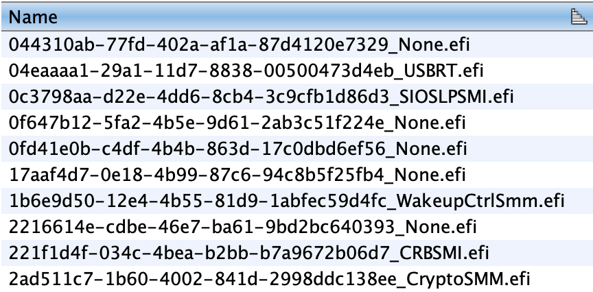
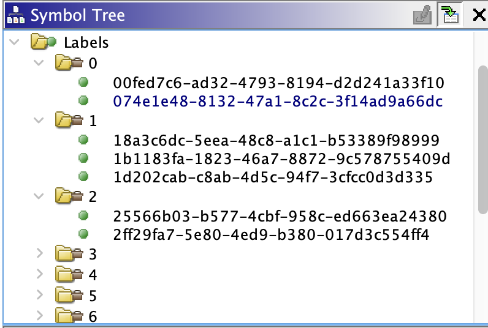

# SMRAM Loader for Ghidra

## About

This loader finds SMM drivers and protocols, their guids and disassemble drivers for better analysis.

## Features

### Finds SMM drivers and their guids

### Identifies protocols 

## Installation

Set `GHIDRA_INSTALL_DIR` environment variable to ghidra path.

Start `gradlew.bat`, after the completion of building copy archive from the `dist` directory to `GHIDRA_HOME_DIR/Extensions/Ghidra/`.
And turn on this extention in your ghidra.

## Usage

Before loading dump into ghidra, you can use python script (UefiImportToGhidra.py at "python script" folder), thas finds guids from UEFI image of pc, which smram was dumped, and import them into json file, that can be used by loader. Otherwise without json file SMM drivers will be named as "Undefined.efi". Instruction to script you can find at the same folder.

note: json file must have same name as dump (smram_dump.bin -> smram_dump.json) and must be located at the same directory as dump. 